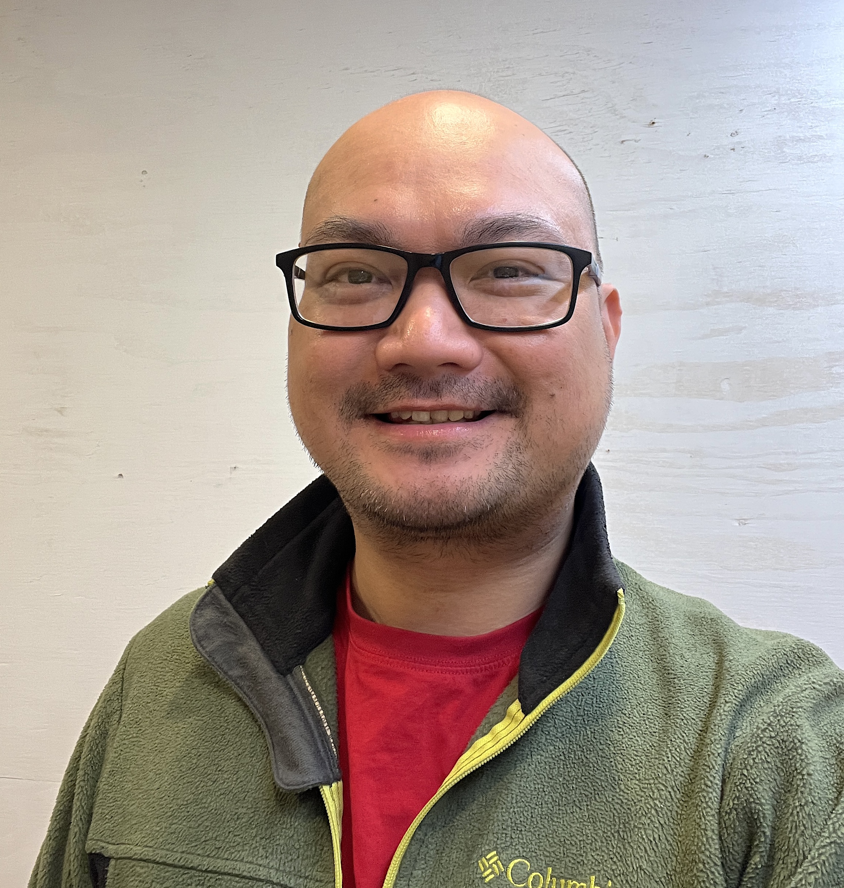

```{r setup, include=FALSE}
knitr::opts_chunk$set(echo = TRUE)
```

### **James**
Dr. James Santiago is an Assistant Professor of Horticulture at the University of Illinois in the Department of Crop Sciences. Originally from the Philippines, James moved across the Pacific Ocean to pursue higher education in the United States where he received a Master in Science in Horticulture at the University of Maine and a Doctorate in Molecular Plant Sciences at Washington State University. He then trained as a postdoctoral fellow under Tom Sharkey at Michigan State University. Prior to becoming a professor, James had a brief stint in the industry working as R&D Plant Physiologist at a vertical farming company in Virginia. <br> 
Email: [santjpm\@gmail.com](mailto:santjpm@gmail.com){.email} <br>

::: {style="text-align:left;"}
{width="2in"}
:::


<br>


### **You?**

::: {style="text-align:left;"}
{width="2in"}
:::

<br>

### **Employment Opportunities**

I am looking for a Masters level graduate student. Please contact James if you are interested.
